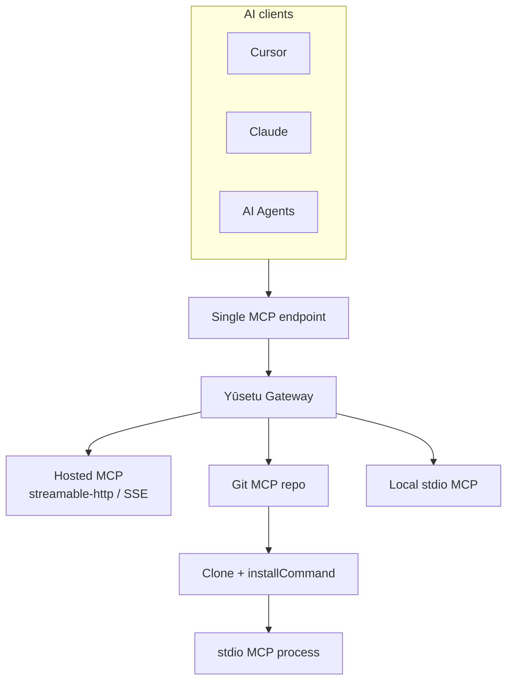

<p align="center">
  
</p>

# Yūsetu

## Stupidly Simple and Straight Forward MCP Gateway

[](LICENSE)
[](https://github.com/builtbyaakash/yusetu)

Connect hosted MCPs, or point Yūsetu at an MCP Git repository and let Yūsetu run it for you. Access everything through a single MCP endpoint.

> **Don't have a hosted MCP? Just give Yūsetu the Git repo.**

Open-source · self-hosted · [github.com/builtbyaakash/yusetu](https://github.com/builtbyaakash/yusetu)

---

## The problem

As you adopt MCP, you end up with many servers: some hosted, some local stdio, some only published as Git repos. Each AI client (Cursor, Claude, agents) wants its own connection config.

That means cloning repos, installing deps, wiring env vars, and pasting the same MCP blocks into every client.

Yūsetu is one place to register those MCPs and one endpoint for every client.

---

## Don't have a hosted MCP? Just give Yūsetu the Git repo.

Many MCP projects ship as source only. Instead of:

**clone → install → configure → expose → paste into every client**

you can register an HTTPS Git URL in Yūsetu. On create/update the gateway:

1. Clones the repo under `YUSETU_DATA_DIR/mcp-sources/{slug}`
2. Optionally runs your `installCommand` (argv, no shell)
3. Spawns the MCP as a **stdio** process (`command` + `args`)
4. Discovers tools and exposes them on the shared gateway endpoint

```text
Git repository (HTTPS)
        ↓
     Yūsetu  (clone + optional install)
        ↓
  stdio MCP process
        ↓
  Single MCP endpoint (/mcp or stdio bridge)
        ↓
  Cursor / Claude / agents
```

### What works today

| Piece | Behavior |
| --- | --- |
| URL | `http://` or `https://` Git remotes only (no `ssh://`, no `git@…`, no credentials in the URL) |
| Ref | `gitRef` branch/tag/commit (default `main`) |
| Install | Optional `installCommand` — space-split argv run once after checkout on **create/update** (not on Rediscover) |
| Runtime | **stdio only** for Git-sourced MCPs; whatever `command`/`args` you set (`node`, `uv`, `uvx`, `npx`, …) must be on the **gateway host PATH** |
| Working dir | Forced to the checkout directory |
| Secrets | Encrypted at rest (`GATEWAY_MASTER_KEY`); keys become env vars for the child process |
| Failures | Clone/install errors return HTTP 400; runtime issues show **Unhealthy** on the MCP; stderr goes to gateway logs |

**Not implemented:** Docker builds of MCP images, SSH clone, sandbox/container isolation, or re-install on Rediscover.

**Trust model:** Yūsetu runs third-party code on the gateway host. Only add repositories you trust. See [Security](#security).

The official Docker image is Node-only (no `git`/`uv` baked in). For Git MCPs, run on a host that has the tools you need, or build a custom image.

---

## Architecture



Clients only talk to Yūsetu. Upstream MCPs are registered in the dashboard (hosted URL, local stdio, or Git checkout).

---

## Currently available

### Git repository MCPs

Point Yūsetu at an MCP Git repository (HTTPS). Yūsetu clones it, optionally installs, runs it as stdio, and exposes its tools on the gateway.

### Multiple MCP connections

Register many upstreams — hosted HTTP/SSE, local stdio, or Git — behind one gateway.

### Unified MCP endpoint

Clients connect once (HTTP `/mcp` or the stdio bridge). They do not need a config block per upstream.

### Tool discovery and execution

Default catalog is **meta mode**: five gateway tools (`yusetu_search_tools`, `yusetu_list_mcps`, `yusetu_list_tools`, `yusetu_get_tool`, `yusetu_call`). Preferred path: search → get tool schema → call. BM25 search and optional schema compression cut **tool-definition** tokens vs dumping every upstream schema.

### API key authentication

Protect `/mcp` with API keys (`Authorization: Bearer …` or `X-Api-Key`). Create and revoke keys in Settings. Optional OAuth 2.1 PKCE for HTTP clients.

### Upstream OAuth and secrets

Connect OAuth-capable hosted MCPs from the dashboard. Store static secrets encrypted; use `header.*` keys for HTTP headers (e.g. `header.Authorization`).

### Self-hosted and open source

Run it on your machine or infra. **MIT** licensed.

---

## Example workflow

1. **Add an MCP** in the dashboard (hosted URL, stdio command, or Git repo).
2. Yūsetu **connects / starts** it (clone + install for Git sources).
3. Yūsetu **discovers tools** (auto on create when possible; otherwise Rediscover).
4. **Create an API key** in Settings.
5. Point Cursor/Claude at Yūsetu — use the tools via the meta catalog.


### Client config (real)

Gateway must already be running (`pnpm dev`, `pnpm start`, or Docker).

**HTTP (Cursor / Streamable HTTP):**

```json
{
  "mcpServers": {
    "yusetu": {
      "url": "http://127.0.0.1:8080/mcp",
      "headers": {
        "Authorization": "Bearer <your-api-key>"
      }
    }
  }
}
```

**STDIO bridge** (after `pnpm build`):

```json
{
  "mcpServers": {
    "yusetu": {
      "command": "node",
      "args": [
        "/ABS/PATH/TO/Yusetu/apps/gateway/dist/cli/index.js",
        "stdio"
      ],
      "env": {
        "PORT": "8080",
        "YUSETU_API_KEY": "<your-api-key>"
      }
    }
  }
}
```

Copy live snippets from **Settings** in the dashboard.

---

## Hosted MCP vs Git MCP

| MCP source | What Yūsetu does |
| --- | --- |
| Hosted MCP endpoint | Connect (streamable-http or SSE; OAuth or static headers) |
| MCP Git repository | Clone, optional install, run as stdio inside the gateway |
| Local stdio binary | Spawn with `command` / `args` / secrets |
| Multiple MCPs | One gateway catalog and one client endpoint |
| Multiple clients | All point at Yūsetu |

---

## Quick start

Requirements: **Node.js 22** (not 26 — `better-sqlite3`), **pnpm 9**.

```bash
git clone https://github.com/builtbyaakash/yusetu.git
cd yusetu
pnpm install
cp .env.example .env
openssl rand -base64 32   # paste into GATEWAY_MASTER_KEY=
pnpm rebuild:native       # if you hit NODE_MODULE_VERSION errors
pnpm dev
```

- Dashboard: [http://127.0.0.1:5173](http://127.0.0.1:5173)
- Gateway + MCP: [http://127.0.0.1:8080](http://127.0.0.1:8080)

First launch with an empty database opens **signup** (`/setup`) — there is no default admin. Then:

1. Add an MCP (hosted / stdio / Git)
2. Create an API key in Settings
3. Connect Cursor or Claude with the configs above

Production-style:

```bash
pnpm build
pnpm start
# http://127.0.0.1:8080
```

Docker Compose (set `GATEWAY_MASTER_KEY` in `.env` first):

```bash
docker compose up --build
```

---

## Why Yūsetu?

- Stupidly simple: one gateway, one endpoint
- Hosted MCPs and local stdio in the same place
- Git repos can become MCPs without a separate hosting step
- Self-hosted on your infra
- Open source, free to use

No “AI platform” pitch — just an MCP gateway that stays out of the way.

---

## Free. Always.

Yūsetu is open source (**MIT**) and free to use.

You can self-host it, modify it, fork it, and use it for personal or commercial projects under the license terms.

That promise is about **this open-source project**. It does not imply a future hosted Yūsetu cloud product (if any) would be free.

---

## Security

**Git MCPs execute third-party code on the gateway host.** There is no sandbox or container isolation in v1. Treat an untrusted repo like running `npm install && node server.js` on that machine.

- Only add Git repositories you trust.
- Keep `GATEWAY_MASTER_KEY` secret; it encrypts upstream credentials. Losing it makes existing ciphertext unreadable.
- Prefer `REQUIRE_MCP_AUTH=true` (default). Do not expose `/mcp` to the public internet without auth.
- Git clone URLs cannot embed credentials; private repos need a host-level credential helper or a public URL — plan accordingly.
- Secrets without a `header.` prefix are passed as environment variables to stdio children; `header.*` becomes HTTP headers for remote MCPs.
- Official Docker image lacks `git`/`uv`; running Git MCPs in Docker means baking those tools into a custom image and accepting the same trust model.

---

## What's next

Planned — **not** available yet:

1. **Tool groups** — group tools by use case (GitHub, databases, DevOps, …).
2. **Team support** — share and manage MCP configs across a team (today: single-tenant admin).
3. **Scoped API keys** — multiple keys already exist; planned: restrict a key to specific tools.
4. **MCP health monitoring** — upstreams already show healthy/unhealthy; planned: alerts when an MCP goes down.

---

## Contributing

Issues, feature requests, and pull requests are welcome:

- [Open an issue](https://github.com/builtbyaakash/yusetu/issues)
- PRs that improve MCP compatibility, Git-source ergonomics, or gateway clarity are especially useful

---

## Feedback

> Yūsetu is intentionally being built to stay simple.
>
> If you use MCPs, I'd love to hear what feels painful today and what you'd want an MCP gateway to do.

→ [GitHub Issues](https://github.com/builtbyaakash/yusetu/issues)

---

**Brand:** product name **Yūsetu** (macron); package / CLI / config keys use `yusetu`.
