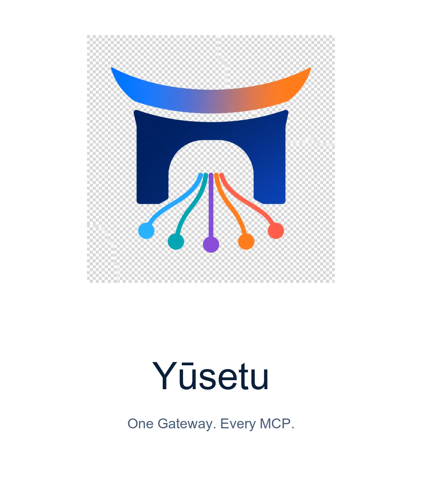
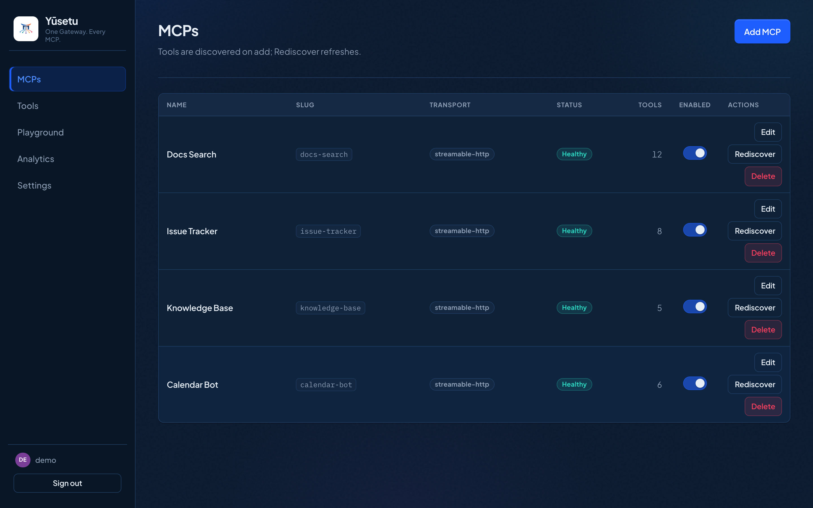
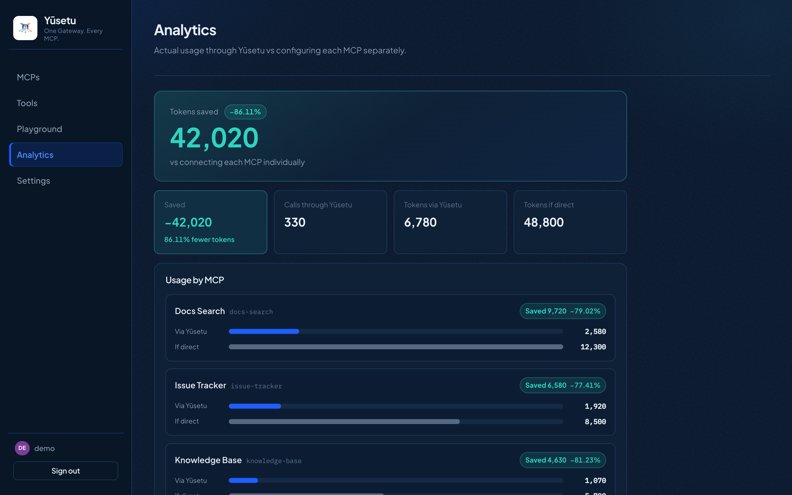
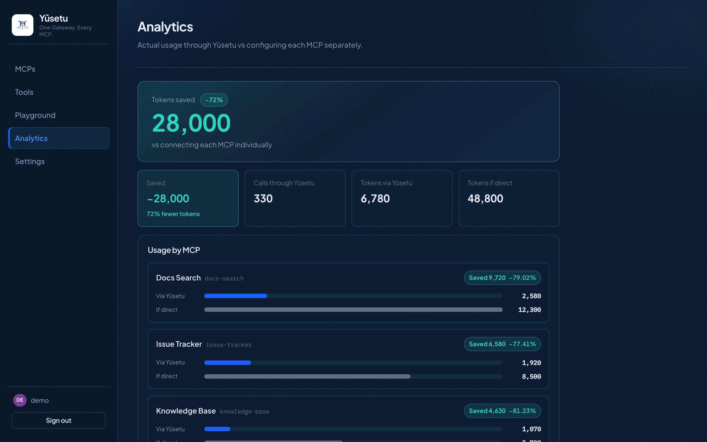

<p align="center">
  
</p>

# Yūsetu

**One Gateway. Every MCP.**

Open-source **MCP gateway / proxy**: one MCP endpoint that aggregates tools from many upstream MCP servers. Self-hosted, single-tenant.

Clients (Claude Desktop, Cursor, agent CLIs) see a single MCP server. Internally, Yūsetu connects to N upstreams (stdio, Streamable HTTP, or SSE), namespaces tools, and routes `tools/call` to the right upstream.

**Stack:** TypeScript · Hono · Drizzle / SQLite · React dashboard

> **Brand:** Product name is **Yūsetu** (with macron). Package / CLI / config keys use `yusetu`.

## Dashboard




Token savings over time:



---

## What is Yūsetu

| Piece | Role |
| --- | --- |
| **Data plane** | MCP facade: `tools/list`, `tools/call`, Streamable HTTP at `/mcp`, STDIO bridge |
| **Control plane** | Admin REST API + React dashboard (setup, login, upstreams, tools, playground) |
| **Storage** | SQLite under `YUSETU_DATA_DIR` (default `./data`) |
| **Secrets** | Upstream credentials encrypted at rest with `GATEWAY_MASTER_KEY` (AES-256-GCM) |

**Dashboard flow:** first-run signup (create admin) → add MCP upstreams → discover tools → enable/disable → playground.

**Tool names (flat mode):** exposed as `{slug}__{toolName}` (e.g. `github__create_issue`).

**Tool catalog (default `TOOL_PRESENTATION=meta`):** agents see five meta tools (BM25 `yusetu_search_tools`, schema compression on `yusetu_get_tool`, plus list/call helpers). Preferred discovery: `yusetu_search_tools` → `yusetu_get_tool` (compressed schema) → `yusetu_call`. That path typically saves **~90–95% of tool-definition / catalog tokens** vs exposing the full union of upstream schemas (not invoke payloads). `yusetu_list_mcps` / `yusetu_list_tools` (`detail=summary` by default) still exist for browsing; prefer summary listing then `yusetu_get_tool` for schemas; use `query` / `ifNoneMatch` to avoid reloading catalogs. Set `INLINE_TINY_MCPS=true` to also inline tiny upstreams as `slug__tool` in `tools/list`. `TOOL_PRESENTATION=flat` is **debug only** (full union of every `slug__tool`).

**Transports:**

- **Streamable HTTP** — `POST` / `GET` / `DELETE` on `/mcp`
- **STDIO bridge** — `yusetu stdio` speaks MCP on stdio and forwards to the local HTTP daemon (one SQLite writer)

---

## Quick start

Requirements: **Node.js 22** (not 26 — `better-sqlite3` has no Node 26 prebuilds), **pnpm 9**.

Root scripts auto-prefer Homebrew `node@22` via `scripts/with-node22.sh` when present at `/usr/local/opt/node@22` or `/opt/homebrew/opt/node@22`.

```bash
pnpm install
cp .env.example .env
openssl rand -base64 32   # paste into GATEWAY_MASTER_KEY in .env
pnpm rebuild:native       # if you hit NODE_MODULE_VERSION errors
pnpm dev
```

- Dashboard (Vite): [http://127.0.0.1:5173](http://127.0.0.1:5173)
- Gateway API + MCP: [http://127.0.0.1:8080](http://127.0.0.1:8080)

**First launch** always opens **signup** (`/setup`) when the database has no users — there is no default admin. Create your admin account, then add upstreams and discover tools. Wiping `data/` (or pointing `YUSETU_DATA_DIR` at an empty directory) resets the install to signup again.

Production-style (build + gateway serves the dashboard static files):

```bash
pnpm build
pnpm start
# open http://127.0.0.1:8080
```

---

## Claude Desktop / Cursor

Run the gateway daemon first (`pnpm dev`, `pnpm start`, or Docker). Then point the client at Yūsetu.

### STDIO bridge (Claude Desktop, Cursor)

`yusetu stdio` forwards MCP over stdio to `http://127.0.0.1:$PORT/mcp` (default port `8080`).

**Claude Desktop** (`claude_desktop_config.json`):

```json
{
  "mcpServers": {
    "yusetu": {
      "command": "node",
      "args": [
        "/ABS/PATH/TO/Yusetu/apps/gateway/dist/cli/index.js",
        "stdio"
      ],
      "env": {
        "PORT": "8080"
      }
    }
  }
}
```

After `pnpm build`, or with the package bin linked:

```json
{
  "mcpServers": {
    "yusetu": {
      "command": "pnpm",
      "args": ["--dir", "/ABS/PATH/TO/Yusetu", "exec", "yusetu", "stdio"],
      "env": {
        "PORT": "8080"
      }
    }
  }
}
```

### HTTP (Cursor / Streamable HTTP clients)

```json
{
  "mcpServers": {
    "yusetu": {
      "url": "http://127.0.0.1:8080/mcp",
      "headers": {
        "Authorization": "Bearer <your-api-key>"
      }
    }
  }
}
```

Copy live URLs and a ready-to-paste snippet from **Settings** in the dashboard.

---

## Connecting clients

### Auth & tool catalog

- **Auth is on by default** (`REQUIRE_MCP_AUTH=true`). MCP clients must send an API key (`Authorization: Bearer <key>` or `X-Api-Key`) or complete OAuth PKCE. Unauthenticated `/mcp` returns `401` with `WWW-Authenticate` so OAuth clients can start login. Set `REQUIRE_MCP_AUTH=false` only for trusted local experiments.
- **Dashboard login** uses a session cookie for the admin UI only — it is not an MCP client credential.
- **API keys** — create/revoke in Settings for scripts, STDIO bridges, and clients that set a static Bearer / `X-Api-Key` (or `YUSETU_API_KEY`).
- **OAuth 2.1 (PKCE)** — Cursor, Claude, and other HTTP MCP clients discover the authorization server from the `401` challenge, then:
  - Protected resource metadata (PRM): `/.well-known/oauth-protected-resource`
  - Authorization server metadata: `/.well-known/oauth-authorization-server`
- **Tool catalog** — default `TOOL_PRESENTATION=meta` exposes five gateway tools (`yusetu_search_tools` with BM25, `yusetu_list_mcps`, `yusetu_list_tools`, `yusetu_get_tool` with schema compression, `yusetu_call`) only. Preferred flow: search → get_tool → call; expect **~90–95% fewer tool-definition tokens** than a flat full-catalog `tools/list` (invoke payloads unchanged). list_mcps/list_tools still available. Tiny MCP inlining is off by default (`INLINE_TINY_MCPS=false`); set `INLINE_TINY_MCPS=true` to add tiny catalogs as `slug__tool`. `TOOL_PRESENTATION=flat` is **debug only** — exposes every `slug__tool`.

---

## Architecture

```
┌──────────────┐     STDIO      ┌─────────────┐    HTTP     ┌────────────────┐
│ Claude/Cursor│ ─────────────► │ yusetu stdio│ ──────────► │                │
└──────────────┘                │   bridge    │             │  Yūsetu        │
                                └─────────────┘             │  gateway       │
┌──────────────┐   Streamable   ┌─────────────┐             │  :8080         │
│ Cursor / CLI │ ── HTTP /mcp ─►│             │────────────►│                │
└──────────────┘                └─────────────┘             │  data plane    │
                                                            │  + control API │
┌──────────────┐                 session cookie             │  + static UI   │
│  Dashboard   │ ──────────────────────────────────────────►│                │
└──────────────┘                                            └───────┬────────┘
                                                                    │
                                                    ┌───────────────┼───────────────┐
                                                    ▼               ▼               ▼
                                              Upstream A      Upstream B      Upstream N
                                              (stdio/HTTP)    (stdio/HTTP)    (stdio/HTTP)
```

- **Data plane** — live MCP traffic; in-memory tool snapshot; routes `{slug}__{tool}` to the upstream client pool.
- **Control plane** — admin auth, upstream CRUD, secret vault, discovery, playground; writes SQLite; refreshes the snapshot.
- **v1 process model** — one Node process hosts both planes (module boundaries stay clean for a later split).

---

## Security notes

- **`GATEWAY_MASTER_KEY`** — required to store/decrypt upstream secrets. Generate with `openssl rand -base64 32`. Losing it makes existing ciphertext unreadable. Do not commit `.env`.
- **Single-tenant** — one admin account per install; bind to `127.0.0.1` for local-only use.
- **`REQUIRE_MCP_AUTH`** — default `true`. Requires API key or OAuth on `/mcp`. Set `false` only for trusted local experiments.
- **`TOOL_PRESENTATION`** — `meta` (production default, 5 gateway meta tools) or `flat` (**debug only**, all `slug__tool` tools).
- **`INLINE_TINY_MCPS`** — when `meta`, optionally inline tiny upstream catalogs into `tools/list` (default `false`).
- **Secrets** — never returned in plaintext after create; logs redact args unless `LOG_TOOL_ARGS` is set carefully.
- **Stdio upstreams** — spawned without a shell (`command` + `args` only).
- **GitHub source (v1):** `gitUrl` + `installCommand` + `command` (stdio MCPs from a git checkout; `cwd` managed by the gateway).

---

## Docker Compose

**You must set `GATEWAY_MASTER_KEY` in `.env` before starting** (same as local). Compose loads `.env` and mounts `./data` for SQLite.

```bash
cp .env.example .env
openssl rand -base64 32   # set GATEWAY_MASTER_KEY=
# For containers, prefer HOST=0.0.0.0 in .env (compose also forces it)
docker compose up --build
```

- UI + API + MCP: [http://127.0.0.1:8080](http://127.0.0.1:8080)
- Persist: `./data` → `/app/data` in the container — **mounting `./data` keeps your admin account** across restarts
- For a **true fresh signup**, use an empty volume (or remove the SQLite DB under `data/`) before starting; otherwise the existing admin is preserved

Stop with `Ctrl+C` or `docker compose down`. Data in `./data` is kept.

---

## Monorepo layout

```
apps/gateway     # Hono server, MCP facade, CLI (yusetu serve | stdio)
apps/dashboard   # React + Vite admin UI
packages/shared  # Shared Zod schemas / helpers
data/            # SQLite + runtime files (gitignored DB files)
docs/brand       # Logo and mark assets
```

---

## License

[MIT](./LICENSE)
