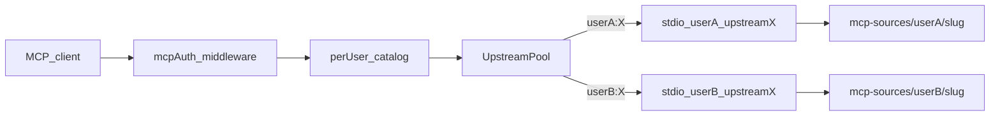

# Teams and per-user MCP isolation

About the single-team deploy model for Yūsetu. One self-hosted instance is one team. Admins publish shared MCPs. Every member can add personal MCPs. Runtime, secrets, git checkouts, and API keys stay isolated per user.

## Goals

- Let team members create accounts after the first `/setup` owner, using invite links.
- Let admins manage shared MCP definitions for the whole team.
- Let each user own personal MCPs that no other user can list, edit, or call.
- Keep git MCP processes, checkouts, and credentials from mixing across users or across MCP instances for the same user.
- Upgrade existing single-admin SQLite installs without wiping data.

## Non-goals (v1)

- Multi-organization SaaS on one database
- Owner transfer UX
- Email delivery for invites (copy-link only)
- SSO or external IdP
- Per-key tool allowlists
- Billing

## Domain model

### Roles

`users.role` is one of `owner`, `admin`, or `member`.

- The first `/setup` user is `owner`. There is exactly one owner in v1.
- Owner and admin manage invites, shared MCPs, and team membership.
- Members manage only their personal MCPs, their credential overlays on shared MCPs, and their own API keys.

### Invites

Table `invites` holds token hash, invited role (`admin` or `member`), creator, expiry, and use metadata. Signup after setup requires a valid unused invite. Open registration stays closed.

### Upstream visibility

`upstreams.visibility` is `shared` or `personal`.

- Shared rows have `owner_user_id` null. Owner and admin create and edit them.
- Personal rows require `owner_user_id`. Only that user creates, edits, and deletes them.

Slug rules.

- Shared slugs are unique among shared upstreams.
- Personal slugs are unique per `(owner_user_id, slug)`.
- A personal slug may match another user’s personal slug.
- A personal slug must not match any shared slug on the instance.

Drop the global `UNIQUE` on `upstreams.slug`. Enforce the rules above in create and update handlers (and with composite indexes where SQLite allows).

### Secrets

- Shared and personal upstreams keep row-level `upstream_secrets` and `upstream_oauth` for definition-owned credentials (admin secrets on shared MCPs, owner secrets on personal MCPs).
- Table `user_upstream_secrets` stores per-user overlays keyed by `(user_id, upstream_id)`.
- Optional `user_upstream_oauth` stores per-user OAuth for shared upstreams when a member connects their own account.
- At connect time, merge overlay over definition secrets. Overlay keys win.

### API keys and usage

- `api_keys.user_id` is required. A key only exposes that user’s catalog.
- `usage_events.user_id` is set when the caller is known. Members query their own events. Owner and admin query team-wide events.

### Tool exposed names

Today `tools.exposed_name` is globally unique. That breaks when two users discover personal MCPs with the same tool names.

- Drop the global unique constraint on `exposed_name`.
- Keep uniqueness inside one caller’s catalog when discovering or enabling tools.
- Reject a personal discover that would collide with a shared exposed name in that user’s view, or with another of that user’s personal tools.

## Auth and access control

### AuthContext

Parse session cookies, API keys, and gateway OAuth access tokens into one internal type at the boundary.

```ts
type Role = "owner" | "admin" | "member";

type AuthContext = {
  userId: string;
  username: string;
  role: Role;
};
```

Capability helpers derive from role. Handlers trust `AuthContext` and do not re-read cookies.

### Control plane

Replace binary `requireAdmin` with `requireSession` plus capability checks.

| Action | Owner / admin | Member |
| --- | --- | --- |
| Invite users | yes | no |
| Manage shared upstreams | yes | read + optional overlay |
| Manage own personal upstreams | yes | yes |
| Manage other personal upstreams | no | no |
| Own API keys | yes | yes |
| Team analytics | yes | own only |
| Playground call | catalog-visible tools only | same |

### Data plane (`/mcp`)

When `REQUIRE_MCP_AUTH` is true (default), middleware resolves `AuthContext` from the API key or `ysat_` token. Catalog, router, and pool require that context. No anonymous full catalog.

## Catalog, pool, and isolation

### Catalog

For caller `U`, the visible enabled upstream set is:

- Every personal upstream where `owner_user_id = U`.
- Every shared upstream that `U` may read under grants:
  - Owner and admin bypass the grant table and see all shared upstreams.
  - Members see a shared upstream only when an `upstream_grants` row pairs that upstream with `U`.

Table `upstream_grants` stores `(upstream_id, user_id)` with a unique pair and `created_at`. Migration creates the empty table and does not auto-grant existing shared rows (fail-closed).

Build the MCP tool list and admin tool list from that set only. Elevated callers may list all tools on `/api/tools`. Rebuild or filter the runtime snapshot per caller. A process-wide unfiltered snapshot is not safe.

Shared OAuth status reads use the same grant predicate as admin upstream read. Shared OAuth start and disconnect stay elevated-only.

### Pool

`UpstreamPool` keys clients by `${userId}:${upstreamId}`.

- Invalidate only that pair when secrets, OAuth, or upstream config change for that user.
- Status and warm paths take `userId`.
- Concurrent `callTool` for different users never share one MCP SDK client.

### Git checkouts

Checkout path is `{YUSETU_DATA_DIR}/mcp-sources/{userId}/{slug}/`.

Every user who uses an upstream, shared or personal, gets their own tree. Mutable MCP state cannot cross users. Default isolation for new git MCPs remains `docker`.

### HTTP upstreams

Use the same pool key. Prefer per-user OAuth rows when the member connects. Admin-shared static tokens still open a per-user client so in-memory session state does not leak.



## Dashboard and APIs

### `/api/auth/me`

Returns `id`, `username`, `role`, and capabilities (`canManageUsers`, `canManageSharedMcps`, `canInvite`).

### MCPs page

One list with a Shared / Personal badge and filters (All, Shared, Mine).

- Owner and admin create shared or personal rows and edit shared definitions.
- Members create only personal rows. On shared rows they see a read-only definition and a connect-credentials action when overlay or OAuth is needed.

### Team page

Owner and admin only. Create and revoke invites, list members, change roles, remove members. Reject demoting or removing the last owner. Owner transfer is out of v1.

### Join page

Public route `/join?token=…`. Sets username and password, consumes the invite, starts a session.

### Settings

API keys are per user. Connection snippets use that user’s key. Gateway MCP URLs stay the same.

## Migration

Run on gateway boot (or a dedicated migrate step) using the existing SQLite alter path in `apps/gateway/src/db/index.ts`.

1. Add role, visibility, owner, invite, overlay, and `user_id` columns and tables.
2. If one user exists, set that user to `owner`. If multiple users exist, set the earliest `created_at` to `owner` and the rest to `admin`.
3. Set every existing upstream to `visibility=shared` and `owner_user_id=null`.
4. Attach every existing API key to the owner.
5. Move `mcp-sources/{slug}/` to `mcp-sources/{ownerUserId}/{slug}/` and update `upstreams.cwd`. The move is idempotent.
6. Rebuild tool indexing after migrate. Drop global unique indexes that block multi-user tool names as part of the same wave.
7. Create empty `upstream_grants` (`schema_grants_v1`). Do not insert grant rows for existing shared upstreams.

New installs keep first-run `/setup`, then use the Team page for invites.

## Verification criteria

These are product gates, not only typecheck.

- Member cannot `PATCH` or `DELETE` a shared upstream (403).
- Member cannot `GET` another user’s personal upstream (404 or 403, consistent per API).
- Member’s `/mcp` tools/list omits other users’ personal tools.
- Two users calling the same shared git MCP use different pool keys and different checkout directories (observable via cwd and process list or gateway debug logs).
- Invite signup creates a `member` who can add a personal MCP and create an API key scoped to that catalog.
- Existing single-admin DB boots, migrates, and serves shared upstreams for the owner (elevated bypass). Members see shared only after an `upstream_grants` row.
- Member `/api/tools` and catalog omit ungranted shared tools and other users' personal tools.

## File touch list (implementation guide)

Primary paths already in the tree.

- `apps/gateway/src/db/schema.ts`, `apps/gateway/src/db/index.ts`
- `apps/gateway/src/auth/*`, `apps/gateway/src/middleware/auth.ts`, `apps/gateway/src/middleware/mcp-auth.ts`
- `apps/gateway/src/admin/upstreams.ts`, `api-keys.ts`, `tools.ts`, `routes.ts`
- `apps/gateway/src/upstreams/pool.ts`, `git-source.ts`, `docker-isolate.ts`
- `apps/gateway/src/mcp/facade.ts`, `router.ts`, `snapshot.ts`, `rebuild-snapshot.ts`
- `apps/dashboard/src/App.tsx`, `pages/UpstreamsPage.tsx`, `SettingsPage.tsx`, new Team and Join pages
- `packages/shared` request and response types
- `README.md` team roadmap item

## Decisions locked in review

- Approach. Single-team tenancy with `shared` + `personal` visibility and per-user runtime isolation.
- Deploy default. One instance equals one team. Not multi-org SaaS.
- Invites. Copy-link only in v1.
- Pool key. Always `${userId}:${upstreamId}`, including shared MCPs that share admin secrets.
